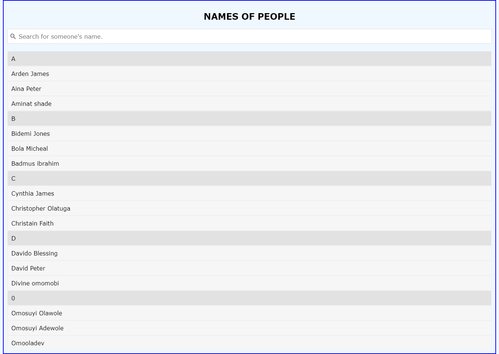

# Search Filter

This webpage was designed for practicing the filter functionality in JavaScript and dynamically updating the
browser's Document Object Model (DOM).

[View the website here](https://mini-website-projects.netlify.app/search-filter)

The screenshot below provides a glimpse of the website.

